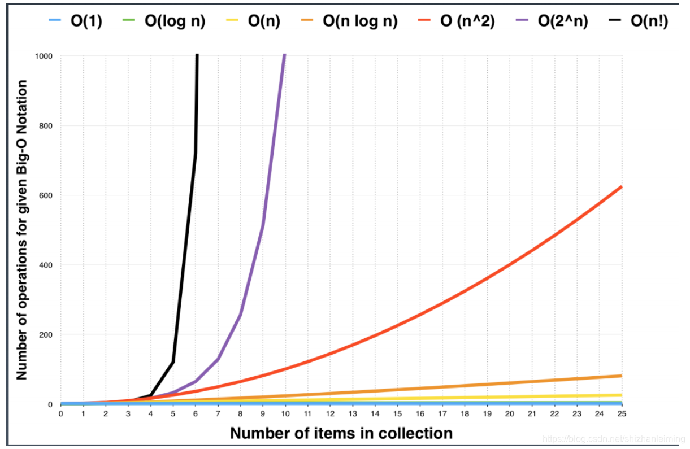

# 常识类问题

# 基础知识
0. 时间复杂度



1. int类型
- 32bit (-2^31~2^31-1)
- 64bit (-2^63~2^63-1)

2. 逻辑运算
    - 异或
    - 与或

# 常用范式
1. 快排（可以使用C++中的algorithm库代替）
2. 判断素数，[参考](https://blog.csdn.net/huang_miao_xin/article/details/51331710)
```c
int prime(long int n) {
    int flag = 1;
    long int i;
    if(n==1 || n==2 || n==3)    return flag;
    if (n%6!=1 && n%6!=5)       return 0;

    for(i=5; i*i<=n; i+=6)
        if(n%i==0 || n%(i+2)==0) {
            flag = 0;
            break;
        }

    return flag;
}
```
1. 最大公约数，**欧几里德算法**
2. 最小公倍数
3. 打印四种蛇形数组，顺时针，逆时针，Z，倒Z。[参考](https://blog.csdn.net/Echo_Ana/article/details/53411476)
4. 素数筛，算法需要好好看看 王道指南P96
5. 素因数分解，多写几遍 P98
6. 二分求幂 P103
7. 图中的单源最短路径算法，参考[LeetCode 743. 网络延迟时间](https://leetcode-cn.com/problems/network-delay-time/)

# 求x的平方根
## 循环
这是自己想到的方法，从1-x/2，判断平方与x的关系。
```cpp
class Solution {
public:
    int mySqrt(int x) {
        if(x <= 1) return x;

        int i, t, ans = 0;
        for(i=1; i<= x/2; i++) {
            if(pow(i, 2)<=x && pow(i+1, 2)>x) {
                ans = i;
                break;
            }
        }

        return ans;
    }
};
```

## 二分查找
循环法的优化，不再遍历，而是采用二分缩短查找时间。
```cpp
class Solution {
public:
    int mySqrt(int x) {
        if(x <= 1) return x;
        int left=0, right=x, ans=-1;
        int mid;
        while(left <= right) {
            mid = left + (right-left)/2;
            if(pow(mid, 2) <= x) {
                ans = mid;
                left = mid + 1;
            } else right = mid-1;
        }

        return ans;
    }
};
```

## 牛顿法
牛顿法利用泰勒级数，F(x)=x*x-C，